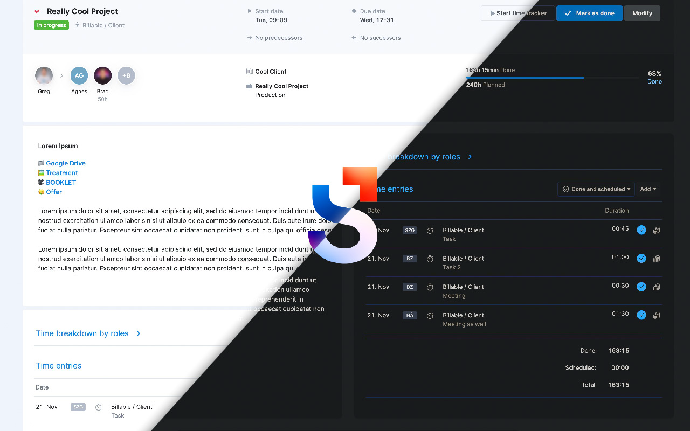

# Scoro UI Refresh & Dark Mode

Quality of life improvements for Scoro.

## Before & After

| Before | After |
|--------|-------|
| .png) | .png) |

## Dark Mode

.png)

## Features

- **Dark Mode:** Dark Reader-powered dark mode for the full Scoro interface.
- **Task Layout Rework:** The user interface for tasks has been rearranged for a cleaner look.
- **Centralized Comments:** The comments section is now aligned to the center.
- **Time Entry Relocation:** Time Entries have been moved next to task notes and are limited in height.
- **Time Entry Dropdown Refinement:** The dropdown menu has been restructured, placing the "Other" option at the top.
- **Keyboard Jump in Time Entry Dropdown:** Clicking the picture opens a dropdown — pressing a letter jumps the selection to that letter.
- **Notification Grouping:** Notifications are grouped by task at scoro.com/notifications. Toggleable, with smart loading and an uncapped Regroup button.
- **Auto-Resizing Comment Field:** The comment input field resizes automatically based on the length of your comment.
- **Comment Draft:** Your comment draft is saved locally and inserted back into the comment field when you reload the task.
- **Offer Hour Summaries:** On both the quote edit and view pages, hours are totalled per section and as a grand total — broken down by offered and internal hours.
- **Back to Finances Button:** On quote view pages, a button appears that takes you directly back to the project's finances tab.
- **Timesheet Future Warning:** Entering time on a future date triggers a warning popup with a "Got it" button or a "Dismiss / Snooze for 10 min" option.
- **Future Column Dimming:** Future dates on the timesheet are visually dimmed. A toggle button ("Future 👁️ / 🙈") in the View filter lets you turn this on or off.
